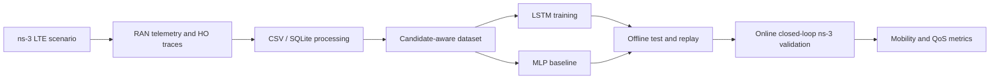

# Predictive Mobility Management in LTE/O-RAN with ns-3 and LSTM

## О проекте

Публичный portfolio-пакет по проекту интеллектуального управления мобильностью в LTE / Open RAN-like сценарии.

Проект отвечает на прикладной RAN-вопрос: может ли ML-контроллер использовать компактную радиотелеметрию для поддержки handover-решений и при этом балансировать стабильность мобильности и QoS.

## Почему это релевантно YADRO

Проект находится на стыке разработки и моделирования телеком-систем:

- C++-сценарии `ns-3` для multi-cell LTE/O-RAN-like симуляций;
- сбор RAN-телеметрии: `RSRP`, `RSRQ`, `SINR`, `BLER/TBLER`, throughput, delay, handover events;
- Python/PyTorch pipeline для dataset preparation, training, replay и online inference;
- candidate-aware LSTM для handover trigger и target-cell prediction;
- MLP baseline для проверки вклада candidate-aware постановки;
- online closed-loop проверка в симуляторе и сравнение с A3 baseline.

## Краткая схема



## Основные результаты

Offline test для candidate-aware LSTM K=3:

| Метрика | Значение |
| --- | ---: |
| Trigger F1 | 0.6888 |
| Candidate target accuracy | 0.8967 |
| Candidate macro-F1 | 0.8973 |
| Candidate hit rate | 0.9862 |

Candidate-aware MLP baseline:

| Метрика | Значение |
| --- | ---: |
| Parameters | 180,311 |
| Test trigger F1 | 0.6890 |
| Test target accuracy | 0.9089 |

Final matched 900 s online summary over runs 1, 3, 5, and 6:

| Режим | HO Count | Ping-Pong Rate | Mean Dwell (s) | DL Throughput (Mbps) |
| --- | ---: | ---: | ---: | ---: |
| A3 | 2329.50 | 0.2673 | 10.9621 | 33.8246 |
| LSTM-only | 1477.50 | 0.1863 | 17.1526 | 31.4682 |
| LSTM+A3 hybrid | 2441.75 | 0.2539 | 10.4093 | 34.0699 |

Интерпретация:

- `LSTM-only` снижает число handover и ping-pong, увеличивает среднее время пребывания в соте.
- `LSTM+A3 hybrid` лучше сохраняет QoS/throughput и ближе к A3 по сервисным метрикам.
- Главный вывод: меньше handover не всегда означает лучшее качество сервиса, поэтому модель нужно оценивать по нескольким телеком-метрикам одновременно.

## Что смотреть в первую очередь

1. [`scenarios/lte-oran-helper-lstm-hex7.cc`](scenarios/lte-oran-helper-lstm-hex7.cc) - интеграция online-контроллера в ns-3.
2. [`src/oran_e2_lstm/model.py`](src/oran_e2_lstm/model.py) - candidate-aware LSTM.
3. [`src/oran_e2_lstm/persistent_inference_worker.py`](src/oran_e2_lstm/persistent_inference_worker.py) - persistent Python inference worker.
4. [`src/oran_e2_lstm/replay.py`](src/oran_e2_lstm/replay.py) - replay-анализ политик.
5. [`baselines/mlp/README.md`](baselines/mlp/README.md) - MLP baseline.
6. [`docs/YADRO_REVIEW_GUIDE_RU.md`](docs/YADRO_REVIEW_GUIDE_RU.md) - краткий гид на русском.

## Структура репозитория

```text
scenarios/              ns-3 C++ scenario files and run script
src/oran_e2_lstm/       Python dataset, model, training, replay, and inference code
baselines/mlp/          MLP baseline scripts, compact CSV results, and checkpoint
results/                compact CSV/Markdown summaries
docs/                   short project notes for technical review
```

## Что не включено

Репозиторий намеренно сделан компактным. В него не включены:

- raw traces;
- SQLite databases;
- packet captures;
- full `ns-3` source tree and build artifacts;
- private documents;
- large run folders.

## Quick Start

Create a Python environment:

```bash
python3 -m venv .venv
source .venv/bin/activate
pip install -r requirements.txt
```

Expected ns-3 workflow:

```bash
export NS3_ROOT=/path/to/ns-allinone-3.46.1/ns-3.46.1
cp scenarios/*.cc "$NS3_ROOT/scratch/"
cp scenarios/run_v7_lstm_sequence.sh "$NS3_ROOT/"
```

Then configure these environment variables for your local setup:

```bash
export PYTHON_BIN=/path/to/python
export INFERENCE_SCRIPT=/path/to/persistent_inference_worker.py
export CHECKPOINT_PATH=/path/to/best_model.pt
```

Run a scenario from the ns-3 root after adapting paths and building ns-3.

## Reproducibility

See [REPRODUCIBILITY.md](REPRODUCIBILITY.md).

The public package is intentionally compact. It is enough to review the method and code structure, but exact numeric reproduction requires regenerating raw ns-3 traces.

## License

License is intentionally not finalized in this package. The Python code can likely use a permissive license if fully authored by the project owner. The C++ scenario files depend on ns-3, so license compatibility should be checked before publishing.
